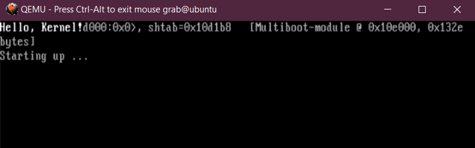
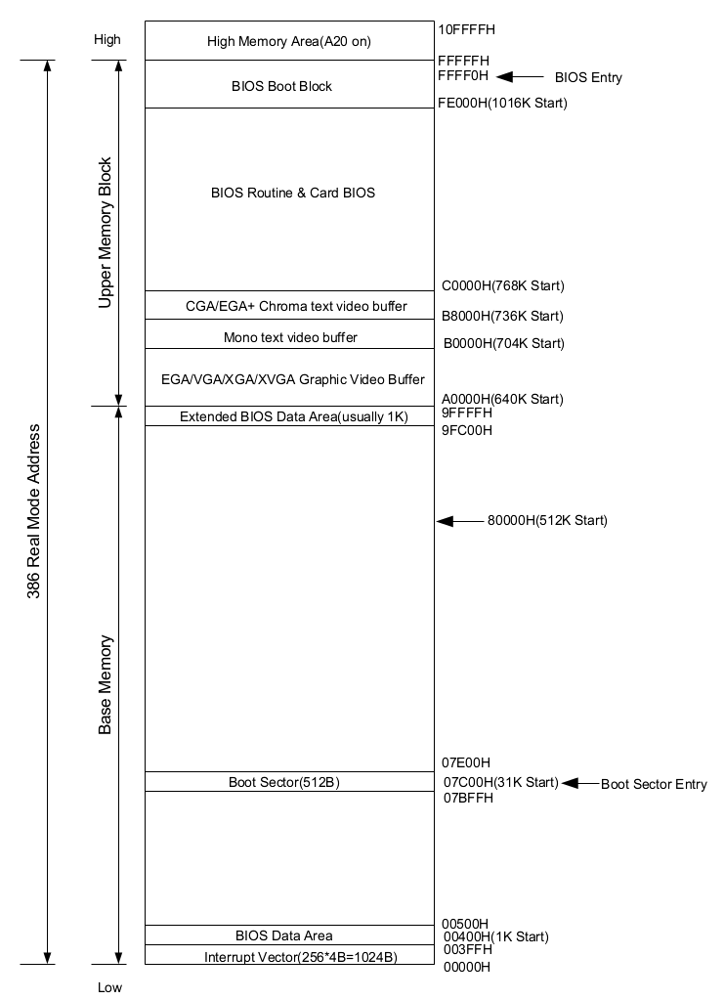
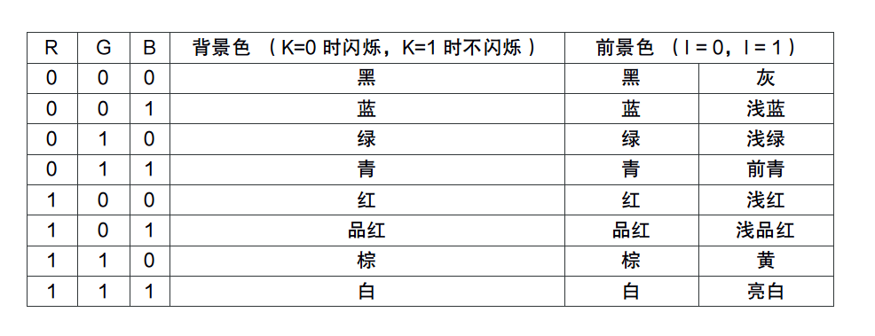

- [第一章](#第一章)
	- [参考](#参考)
- [第二章](#第二章)
	- [`Multiboot Header`](#multiboot-header)
	- [`boot.s`其它解释](#boots其它解释)
	- [`kern_entry`](#kern_entry)
	- [`types.h`](#typesh)
	- [`Makefile`](#makefile)
	- [`kernel.ld`](#kernelld)
	- [需要安装的程序](#需要安装的程序)
	- [运行](#运行)
- [第三章](#第三章)
	- [硬件操作](#硬件操作)
	- [VGA模式](#vga模式)
	- [显卡原理](#显卡原理)
	- [显示过程的总结](#显示过程的总结)
	- [内码](#内码)
	- [端口读写函数](#端口读写函数)
	- [屏幕操作函数](#屏幕操作函数)
	- [`entry.c`](#entryc)

## 第一章

根据wikipedia给出的解释来看，所谓操作系统：

> An operating system (OS) is system software that manages computer hardware and software resources and provides common services for computer programs. All computer programs, excluding firmware, require an operating system to function.

可以说操作系统是直接与底层硬件打交道的一个“程序”，因此对它的研究，可以对计算机运行和组成有更加深刻的了解与认识。

一般来说，操作系统具有这样的功能：

- 进程管理（Processing management）
- 内存管理（Memory management）
- 文件系统（File system）
- 网络通信（Networking）
- 安全机制（Security）
- 用户界面（User interface）
- 驱动程序（Device drivers）

这些功能中，对于学习有更达帮助的，主要是进程管理，内存管理，文件系统。

这些内容是一个操作系统核心的内容，现代的操作系统课程也会把重点放在这些地方，特别是进程之间的转换，锁死等内容，更是很多操作系统课程必讲的内容。

对计算机基础内容，我们的重点主要在于底层结构的探索，在掌握了计算机组成原理的情况下，明白它是如何从加电到实现这些功能的。

关于内存管理，这里做一个比较详细的实现。为了运行一些硬件，也必须设计几个驱动程序，在最后做一个简单的进程切换。

其它的，像是文件系统，也是操作系统的重点，但由于这里使用1.44MB的软盘来装我们的操作系统，实在没有多余空间实现文件的管理了。

至于网络通信，安全机制等目前还无需过多考虑。

---

作为一个操作系统，它最大的特点就是能够直接在裸机上运行，但这并不意味着操作系统就是计算机启动的第一道工序了。

实际上，计算机启动过程中，首先会发生以下事件（以下基于32位操作系统来叙述）：

- 当按下电源的时候，会发送一个重置信号给CPU
- CPU将寄存器设为预设值，然后开始执行指令。第一条执行的指令地址是0xFFFF0，这个地址指向BIOS。
- BIOS运行POST（Power-On Self Record），检测之后，没有问题，跳到MBR(Master Boot Record)

这些内容都是计算机的标准，我们无法改变，也不需要了解深入，直接从BIOS看起。

BIOS是一个程序员，或者说是电脑工作者，在电脑启动后第一个接触的部分了。所谓BIOS，指的是在ROM里面存储的一个小程序，它可以设定计算机的一些硬件状态（也就是CMOS参数），以及设定我们的启动顺序等。并在这些设定完成后，将操作转移到MBR。

BIOS判断一个存储分区是否为MBR的方法如下，如果**一个存储设备的第一个扇区中偏移510和511字节处的byte是0x55和0xAA**，那么这个分区就是引导分区。这个数字也被称为魔数(Magic number，在计算机里经常用到的一个术语，往往是一些特定的数字，用以提供必要的信息)

BIOS确立这个扇区是操作系统后，会将前512字节的内容，加载到内存`0x0000:0x7c00`处，然后开始执行加载的代码。

但这第一步加载的内容实在太少了，根本不够实现一个操作系统。解决办法是写一个引导程序，通过这个引导程序引导我们的系统。

但这512byte还是太小了，即使要实现一个好一点的引导程序都很困难，比如支持多启动（multiboot）的引导程序。所以产生了双阶段的引导，从这个扇区再引导到另一个复杂的引导程序，再由引导程序选择要引导的系统。

现在主要的BootLoader都是这样实现的，比如GRUB(这个有一定争议的地方在于，GRUB实现引导可以看成三阶段引导)。

这里实现的这个小的内核，就是用了GRUB来做引导，因为写一个BootLoader并不容易，而且更多的是需要一些文档规范的知识，对操作系统的研究帮助不大。这里就不再重复造轮子了。

具体来说，要有一个可以引导的磁盘，这里采用1.44MB的软盘作为我们的磁盘。这个磁盘里面需要装一个GRUB，并且设定好它的扇区。

但这里我们不再去实现，而是采用JamesM先生已经实现好的这个小磁盘。

要自己写的话，参考链接如下：

<https://www.gnu.org/software/grub/manual/html_node/Making-a-GRUB-bootable-CD_002dROM.html>


### 参考

- [计算机启动过程](https://www.engineersgarage.com/tutorials/how-computer-boots-up/)

## 第二章

这里以NASM来作为汇编语言的编译器，GCC作为C语言的编译器，用Makefile作为编译的脚本来实现项目管理，qemu作为我们的虚拟机来运行我们的小程序。各个语言具体语法不介绍了。

首先来说这个系统的进入方式，是通过GRUB用来判断的规范作为我们的指引，这一部分使用汇编来实现，这个程序的名字是任意的，但为了表明它所做的工作，我们将它命名为`boot.s`。

```nasm
MBOOT_HEADER_MAGIC  equ     0x1BADB002
MBOOT_PAGE_ALIGN    equ     1 << 0
MBOOT_MEM_INFO      equ     1 << 1
MBOOT_HEADER_FLAGS  equ     MBOOT_PAGE_ALIGN | MBOOT_MEM_INFO
MBOOT_CHECKSUM      equ     - (MBOOT_HEADER_MAGIC + MBOOT_HEADER_FLAGS)

STACK_SIZE          equ     32768       ; 定义栈的尺寸大小
 
GLOBAL start            ; 内核代码入口
GLOBAL glb_mboot_ptr    ; 向外部声明的struct multiboot*变量
EXTERN kern_entry       ; 主函数入口

[BITS 32]             ; 内核以32位形式编译

section .text         ; 代码段

align 4               ; 4字节对齐

Multi_boot_header:    ; 声明变量，只用`Multiboot Header`必须的那些部分
    dd MBOOT_HEADER_MAGIC
    dd MBOOT_HEADER_FLAGS
    dd MBOOT_CHECKSUM

start:                  ; 汇编的指令开始的地方，前面声明这个入口了
    cli            ; 此时还没有设置好保护模式的中断处理，所以必须关闭中断
    mov esp, stack+STACK_SIZE   ; 设置内核栈地址 
    mov ebp, 0                  ; 帧指针修改为 0
    mov [glb_mboot_ptr], ebx    ; 将 ebx 中存储的指针存入全局变量
    call kern_entry             ; 调用内核入口函数，也就是我我们的主函数

stop:
    hlt  
    jmp stop  

section .bss

glb_mboot_ptr: 
    resb 4

stack:
    resb STACK_SIZE
```

这个部分的代码还是蛮复杂的，里面有些需要说明的地方。

首先，我们的内核是ELF格式的（可以简单理解为目前Linux系统下的默认可执行格式，windows下是exe），虽然我们的GRUB并没有做这个要求，但为了方便，所以采用这个格式，也因此对应的有这个格式的一些魔数，规范等。

首先，GRUB有什么要求呢？能够被GRUB引导的内核有两个条件： 

1. 需要有一个`Multiboot Header` ，这个`Multiboot Header`必须在内核镜像的前8192个字节内，并且是首地址是 4 字节对齐的。  
2. 内核的加载地址在1MB以上的内存中，这个要求是GRUB附加的，并非多重引导规范的规定。

### `Multiboot Header`

关于Multiboot header各个位分布如下：

Offset|Type|FieldName|Note
---|---|---|---
0|`u32`|`magic`|required
4|`u32`|`flags`|required
8|`u32`|`checksum`|required
12|`u32`|`header_addr`|if flags[16] is set
16|`u32`|`load_addr`|if flags[16] is set
20|`u32`|`load_end_addr`|if flags[16] is set
24|`u32`|`bss_end_addr`|if flags[16] is set
28|`u32`|`entry_addr`|if flags[16] is set
32|`u32`|`mode_type`|if flags[2] is set
36|`u32`|`width`|if flags[2] is set
40|`u32`|`height`|if flags[2] is set
44|`u32`|`depth`|if flags[2] is set

这里介绍一下设置了的值：

- `magic`：魔数，它必须等于十六进制值`0x1BADB002`。 
- `flags`：flags域指出OS映像需要引导程序提供或支持的特性。
  
  - 0-15位指出**必须的特性**：如果引导程序发现某些值被设置，但出于某种原因不理解或不能不能满足相应的需求，它必须告知用户并宣告引导失败。
  - 16-31位指出**可选的特性**：如果引导程序不能支持某些位，它可以简单的忽略它们并正常引导。
  
  - 如果设置了flags中的0位，所有的引导模块将按页（4KB）边界对齐。
  - 如果设置了 flags 字中的1位，则必须通过Multiboot结构的`mem_*`域包括可用内存的信息。

- `checksum`：checksum 是一个32位的无符号值，当与其他的magic域（也就是magic和flags）相加时，结果必须是 32 位的无符号值 0（即magic + flags + checksum = 0）

关于multiboot header的详细规范参考GRUB的[文档](https://www.gnu.org/software/grub/manual/multiboot/multiboot.html#Header-layout)
 
上面的`boot.s`中前几行正是分别对应`magic`，`flags`和`checksum`

```nasm
MBOOT_HEADER_MAGIC  equ     0x1BADB002
MBOOT_PAGE_ALIGN    equ     1 << 0
MBOOT_MEM_INFO      equ     1 << 1
MBOOT_HEADER_FLAGS  equ     MBOOT_PAGE_ALIGN | MBOOT_MEM_INFO
MBOOT_CHECKSUM      equ     - (MBOOT_HEADER_MAGIC + MBOOT_HEADER_FLAGS)
```

> 这里啰嗦一点，上面的移位操作，在这种底层设计里很多。
> 
> 其理解为：把某个值向左，或者向右移动指定位数。
> 
> 举例来说：
> - `1<<0`, 就是把1左移0位，实际并无意义，但写在代码里便于理解。
> - `1<<1`,就是把1左移1位，实际就相当于乘了2，而在FLAG里，由于每一位都有其特定含义，因此这样表示我们就很清楚这个数字是在第二位。
> 
> 接下来的`MBOOT_PAGE_ALIGN | MBOOT_MEM_INFO`，就很清楚说明设定了`MBOOT_PAGE_ALIGN`和`MBOOT_MEM_INFO`这两个位

### `boot.s`其它解释

除了前面的宏定义外，还定义了栈的尺寸大小。内核代码入口，multiboot变量，以及主函数的入口kern_entry。

其中内核代码入口`start`就是ELF文件开始执行的位置，这部分接下来会在链接文件里叙述。在`start`最后调用主函数`kern_entry`。

multiboot变量里会存我们系统开始执行的一些重要的信息，需要把这些信息传递出去。

`[BITS 32]`，是说我们的代码要用32位的形式编译。而align 4是4字节对齐的含义。

当主函数执行完毕后。就进入`stop`hlt停机了，这里是个无限循环。

具体要实现的内容用C来写，写在`kern_entry`中

### `kern_entry`

程序非常简单，起名叫`entry.c`，如下所示：

```c
#include "types.h"

int kern_entry()
{
	uint8_t *input = (uint8_t *)0xB8000;
	uint8_t color = (0 << 4) | (15 & 0x0F);

	*input++ = 'H'; *input++ = color;
	*input++ = 'e'; *input++ = color;
	*input++ = 'l'; *input++ = color;
	*input++ = 'l'; *input++ = color;
	*input++ = 'o'; *input++ = color;
	*input++ = ','; *input++ = color;
	*input++ = ' '; *input++ = color;
	*input++ = 'K'; *input++ = color;
	*input++ = 'e'; *input++ = color;
	*input++ = 'r'; *input++ = color;
	*input++ = 'n'; *input++ = color;
	*input++ = 'e'; *input++ = color;
	*input++ = 'l'; *input++ = color;
	*input++ = '!'; *input++ = color;

	return 0;
}
```

这一部分和最简单的Hello world程序区别不大，唯一的是我们的入口主函数从`main()`变成了`kern_entry()`。

为了让我们的程序显示一点内容，我们在这里输出一个hello, kernel! 但这个怪异的写法在这里就不深究了，后面讲到打印输出的时候就会明白了。

这里颜色可以更改，`uint8_t color = (0 << 4) | (15 & 0x0F)` 这句话中，前面左移4位的0表示黑底，后面和`0x0F`即`1111`取交的是第十五位，代表了白字。

### `types.h`

另外为了统一格式，这里在`types.h`中重新定义了格式：

```c
#ifndef INCLUDE_TYPES_H_
#define INCLUDE_TYPES_H_

#ifndef NULL
	#define NULL 0
#endif

#ifndef TRUE
	#define TRUE  1
	#define FALSE 0
#endif

typedef unsigned int   uint32_t;
typedef          int   int32_t;
typedef unsigned short uint16_t;
typedef          short int16_t;
typedef unsigned char  uint8_t;
typedef          char  int8_t;

#endif 	// INCLUDE_TYPES_H_
```

这样重新定义的好处在于，如果一旦需要在其它平台使用，只需要在这里对我们的定义的类型重新设置就可以了，极大增加了可移植性。

### `Makefile`

终于，我们有了第一部分的代码了。应该编译运行了，我们用Makefile来实现。

Makefile是linux下自动编译的一个脚本，根据规则写好编译的方式，在shell里直接输入`make`就能对我们的文件批量进行编译。

GNU关于Makefile的文档参考：[GNU make](https://www.gnu.org/software/make/manual/make.html)

这里的Makefile的脚本如下：

```makefile
C_SOURCES = $(shell find . -name "*.c")
C_OBJECTS = $(patsubst %.c, %.o, $(C_SOURCES))
S_SOURCES = $(shell find . -name "*.s")
S_OBJECTS = $(patsubst %.s, %.o, $(S_SOURCES))

CC = gcc
LD = ld
ASM = nasm

C_FLAGS = -c -Wall -m32 -ggdb -gstabs+ -nostdinc -fno-builtin -fno-stack-protector -I include
LD_FLAGS = -T scripts/kernel.ld -m elf_i386 -nostdlib
ASM_FLAGS = -f elf -g -F stabs

all: $(S_OBJECTS) $(C_OBJECTS) link update

# The automatic variable `$<' is just the first prerequisite
.c.o:
	@echo 编译代码文件 $< ...
	$(CC) $(C_FLAGS) $< -o $@

.s.o:
	@echo 编译汇编文件 $< ...
	$(ASM) $(ASM_FLAGS) $<

link:
	@echo 链接内核文件...
	$(LD) $(LD_FLAGS) $(S_OBJECTS) $(C_OBJECTS) -o farenew_kernel

.PHONY:clean
clean:
	$(RM) $(S_OBJECTS) $(C_OBJECTS) farenew_kernel

.PHONY:update
update:
	sudo mount floppy.img /mnt/kernel
	sudo cp farenew_kernel /mnt/kernel/farenew_kernel
	sleep 1
	sudo umount /mnt/kernel

.PHONY:mount
mount:
	sudo mount floppy.img /mnt/kernel

.PHONY:umount
umount:
	sudo umount /mnt/kernel

.PHONY:qemu
qemu:
	qemu -fda floppy.img -boot a

.PHONY:debug
debug:
	qemu -S -s -fda floppy.img -boot a &
	sleep 1
	cgdb -x scripts/gdbinit
```

这里我给自己的内核起名加`farenew_kernel`，如果需要修改，需要把`Makefile`和`floppy.img`里面GRUB的配置文件`/boot/grub/grub.conf`和`/boot/grub/menu.lst`修改。

我的配置分别如下：

```
title=farenew
root (fd0)
kernel /farenew_kernel
```

```
timeout 1
  
title   farenew
        root (fd0)
        kernel /farenew_kernel
        module /initrd
```

另外这里把软盘挂载到了`/mnt/kernel`下，所以需要先建目录：

```
sudo mkdir /mnt/kernel
```

### `kernel.ld`

这里链接文件也需要自己来写，这里起名叫`kernel.ld`，一般来讲，在写程序的时候都不需要关心链接器的事情，但要控制我们内核在内存中的位置，并且进一步控制内核生成代码的情况，这里就自己来写链接脚本。

这里首先说明了程序的入口地址是`start`，然后声明了段起始位置是`0x100000`（1MB），接下来放`text`代码段，并按照4096页对启，后面是`data`数据段，接下来是`bss`变量段，接下来是`stab`，即strtab，存储字符串，最后是`stabstr`。

```ld
ENTRY(start)
SECTIONS
{
	. = 0x100000;

	.text :
	{
		*(.text)
		. = ALIGN(4096);
	}
	.data :
	{
		*(.data)
		*(.rodata)
		. = ALIGN(4096);
	}
	.bss :
	{
		*(.bss)
		. = ALIGN(4096);
	}
	.stab :
	{
		*(.stab)
		. = ALIGN(4096);
	}
	.stabstr :
	{
		*(.stabstr)
	 	. = ALIGN(4096);
	}
	
	/DISCARD/ : { *(.comment) *(.eh_frame) }
}
```

### 需要安装的程序

这里以ubuntu系统为例，需要安装的内容：

- nasm：用来编译汇编：

    ```
    sudo apt install nasm
    ```

- gcc，makefile等：

    ```
    sudo apt install build-essential
    ```

- 虚拟机qemu：

    ```
    sudo apt install qemu
    ```

    然后链接qemu：

    ```
    sudo ln -s /usr/bin/qemu-system-i386 /usr/bin/qemu
    ```


- cgdb：gdb的一个界面增强版，在debug的时候使用：

    ```
    sudo apt install cgdb
    ```

### 运行

此时看一下文件的布局：

```sh
$ tree
.
├── boot
│   └── boot.s
├── entry.c
├── floppy.img
├── include
│   └── types.h
├── Makefile
└── scripts
    └── kernel.ld
```

运行：

```
make
make qemu
```

应该就能看到qemu窗口中的`hello world`了：



退出的话可以直接关窗口，如果运行有问题卡住了，可以用`ctrl-a x`退出

另外也可以远程运行，远程运行的话，可以有这么几种思路：

1. 使用x窗口转发，比较方便。我也是使用这种方法
2. 使用SGABIOS，首先安装sgabios：`apt install sgabios`，然后在makefile中qemu的参数加上`-nographic -device sga`
3. 使用VNC，类似x窗口转发。

此时系统的一些参数：


- CS 指向基地址为 0x00000000，限长为4G – 1的代码段描述符。
- DS，SS，ES，FS 和 GS 指向基地址为0x00000000，限长为4G–1的数据段描述符。
- A20 地址线已经打开。
- 页机制被禁止。
- 中断被禁止。
- EAX = 0x2BADB002
- 系统信息和启动信息块的线性地址保存在 EBX中(相当于一个指针)

运行到这里的代码保存在[chapter2](https://github.com/Farenew/OS/code/chapter2)文件夹下

## 第三章

从上一章我们已经知道，计算机的启动过程如下：

1. 按下电源后，CPU重置
2. CPU设置寄存器，然后发送指令给BIOS，BIOS开始自检并且做必要的设置
3. BIOS执行引导程序，把控制权交给引导程序
4. 引导程序引导系统启动

在BIOS执行的指令中，就包括关于一些必要的硬件的设置，例如显卡如何工作，如何显示字符。这些工作是系统运行过程中必不可少的步骤。

### 硬件操作

而在计算机组成原理中，我们知道计算机对硬件的操作有四种方式：

1. 程序I/O方式（Programmed I/O方式）

	CPU时刻对外设设备状态进行循环检查，直到确定该字已经在I/O控制器的数据寄存器中。

2. 中断驱动方式

	中断驱动方式允许I/O设备主动打断CPU的运行并且请求服务。
	
	在这种方式中，I/O控制器从外围设备读取数据，一旦数据读入到I/O控制器的数据寄存器，便通过控制线给CPU一个**中断**信号，表示数据准备好了，等待CPU请求该数据。

	在每个指令周期的末尾，CPU检查中断，发现有来自I/O控制器的中断的时候，CPU保存当前正在运行程序的上下文，去运行**中断处理程序**处理该中断。（后面几章会重点介绍中断处理程序）
	
	I/O控制器收到CPU的取数据请求后，将数据放到数据总线上，传到CPU的寄存器中。
	
	CPU处理I/O控制器的数据后，恢复此前执行的程序的上下文，继续运行。


3. DMA方式

	在I/O设备和内存之间加上DMA控制器使得数据进行直接传输而不经过CPU。

4. 通道控制方式

	I/O通道是指专门负责输入/输出的处理机，因此属于硬件技术。通道方式由通道控制传输的数据块大小以及传输的内存位置，一个通道可以控制多台设备与内存的数据交换。

在这一章来研究一下如何实现屏幕的输出，要实现输出就必须让显卡来工作，这里对显卡的操作就使用中断驱动方式。

### VGA模式

这里主要讲一下VGA，VGA指的是Video Graphics Array，VGA可以算是一种最基本的显卡，并且提供了关于显示的方式。尽管现代的显卡越来越复杂，但是它们仍然支持以VGA的模式显示，也支持VGA的设置。关于VGA的介绍，可以参考[OS dev关于VGA硬件的介绍](https://wiki.osdev.org/VGA_Hardware)

[VGA显示模式](https://wiki.osdev.org/Drawing_In_Protected_Mode)有如下几种（关于不同的模式以及其沿革，可以参考[维基百科](https://en.wikipedia.org/wiki/List_of_8-bit_computer_hardware_graphics)）：

- `00`：text 40*25 16 color (mono)
- `01`：text 40*25 16 color
- `02`：text 80*25 16 color (mono)
- `03`：text 80*25 16 color
- `04`：CGA 320*200 4 color
- `05`：CGA 320*200 4 color (m)
- `06`：CGA 640*200 2 color
- `07`：MDA monochrome text 80*25
- `08`：PCjr
- `09`：PCjr
- `0A`：PCjr
- `0B`：reserved
- `0C`：reserved
- `0D`：EGA 320*200 16 color
- `0E`：EGA 640*200 16 color
- `0F`：EGA 640*350 mono
- `10`：EGA 640*350 16 color
- `11`：VGA 640*480 mono
- `12`：VGA 640*480 16 color
- `13`：VGA 320*200 256 color

因此设置VGA的寄存器就可以实现不同的显示模式。另外，在这一章开始已经说过，BIOS在开机时会做一些必要的设置，其中就包括对显卡的设置，BIOS阶段是通过[`ini 10h`](https://zh.wikipedia.org/wiki/INT_10H)这个中断命令来设置视频模式的（关于中断在后续章节会有详细的介绍）。

这个工作我们不需要做了，因为在系统加载的过程中，GRUB实现了对显示模式的设置，并且把它设置为了`mode 03`，即可以显示80x25个字符，并且支持颜色。如果想要自己设置的话，可以修改`/boot/grub/menu.lst`这个文件，参考GRUB的手册会有相关的设置方法，例如[这里的](http://pierre.baudu.in/other/grub.vga.modes.html)示例。

### 显卡原理

显卡确定了显示模式后，通过**中断驱动方式**来工作的。在中断驱动中，硬件需要设置数据寄存器和控制寄存器（注意区分硬件的寄存器和CPU的寄存器，二者是不一样的），数据寄存器用来存放硬件的数据，控制寄存器用来控制硬件。而操作寄存器有两种方法：分别是MMIO，指的是memory mapped I/O，此外还有PMIO，port mapping I/O。

其中MMIO是我们这里用的方法，解释一下，MMIO就是说把I/O设备的内存和寄存器映射到主存中。因此**访问对应的地址，就相当于访问对应的设备**。I/O设备会监视CPU的地址总线，CPU访问对应的地址，I/O设备就会响应CPU对的请求，把数据总线连到设备的寄存器上。

这一过程的往往是通过特定的CPU的指令来实现的，比如`in`和`out`这种基于x86和x86-64架构在微处理芯片上设置的指令，它可以在EAX(或者AX，AL)和I/O设备特定的端口通信。I/O设备具有和内存分离的地址空间，通过CPU物理接口上的额外I/O引脚或专用于I/O的整条总线来实现。（在后续的代码中会演示`in`和`out`的用法）

系统的硬件通过特定的设计，可以使得连接在地址总线上的设备只响应特定的地址访问，而其它地址访问不会触发它们。

在前面我们写的`linker.ld`中，最开始的地址就是从1MB开始的，这就是因为在1MB之下作为MMIO映射了一些控制器。具体映射的内容如图所示：



可以看到， 如果是VGA模式，就从`0xA0000`开始，而`0xB0000`开始就是黑白显示。在`0xB8000`开始，是彩色文字显示。前面提到，我们的模式是`03`，在这里就是`0xB8000`~`0xBFFFF`这个地址段。这个地址段映射到文本模式的显存。当访问这些地址的时候，实际上读写的就是显存区域了。显卡会不断地扫描这块内存，这块内存也叫做framebuffer，显卡会把framebuffer的数据显示到屏幕上。

> 其实显卡读内存有三种方式，除了这里说的framebuffer外，还有DMA，即显卡直接从内存读取数据，在显卡中叫做[blitter](https://en.wikipedia.org/wiki/Blitter)；另外还有一种方式是内存共享，即使用[GTT](https://en.wikipedia.org/wiki/Graphics_address_remapping_table)。

### 显示过程的总结

所以总结一下：

1. 如果要控制显卡，在四种控制硬件的方法中，这里使用**中断驱动控制**。在实模式下，相应的控制设置会使用MMIO的方式，映射到内存1MB以下地址中，访问这些对应的地址就可以访问硬件（下面的代码中会有相应的演示，控制显示光标）
2. GRUB已经设置好了显示模式，只需要把要显示的内容放在对应的内存段就好。显卡会按照framebuffer自动读取，并且把这些内容显示出来。

### 内码

那如何编写显示的内容呢？这里使用内码，内码定义了字符在内存中存储的形式，英文编码就是熟悉的的ASCII（American Standard Code for Information Interchange，美国信息交换标准代码）码。对应的关系很简单，从0xB8000这个地址开始，每2个字节表示屏幕上显示的一个字符。一个字节是ASCII码，一个字节是附加码，表示颜色等信息。

颜色含义为：

```
K R G B | I R G B
  back  |  front
```

对应颜色表：



例如使用0x00(0000 0000)作为属性字节就是黑色黑色（你将看不到任何东西）。 0x07（0000 0111）是黑底浅灰DOS默认），0x1F（0001 1111）是蓝白色（Win9x的蓝屏死机），0x2a（0010 1010）是绿色单色怀旧风格。

### 端口读写函数

接下来编写代码，首先需要几个端口读写函数的实现。因为C语言并没有直接操作端口的方法，而且频繁的内联汇编麻烦又容易出错。所以好的做法就是定义几个端口读写函数。代码如下`/libs/common.c`：

```c
#include "common.h"

// 端口写一个字节
inline void outb(uint16_t port, uint8_t value)
{
	asm volatile ("outb %1, %0" : : "dN" (port), "a" (value));
}

// 端口读一个字节
inline uint8_t inb(uint16_t port)
{
	uint8_t ret;

	asm volatile("inb %1, %0" : "=a" (ret) : "dN" (port));

	return ret;
}

// 端口读一个字
inline uint16_t inw(uint16_t port)
{
	uint16_t ret;

	asm volatile ("inw %1, %0" : "=a" (ret) : "dN" (port));

	return ret;
}
```

对应的头文件`/include/common.h`：

```c
#ifndef INCLUDE_COMMON_H_
#define INCLUDE_COMMON_H_

#include "types.h"

// 端口写一个字节
void outb(uint16_t port, uint8_t value);

// 端口读一个字节
uint8_t inb(uint16_t port);

// 端口读一个字
uint16_t inw(uint16_t port);

#endif
```

这里有一些不常用的写法：

1. 内联函数，用`inline`关键字来修饰，这样的声明建议编译器在编译的时候，直接把函数代码插入调用的地方，但这仅仅是建议，一来因为大量的内联会大量占用空间，再者编译器实际执行中也会有自己的优化。内联的好处就是在实际使用执行中不需要函数调用了，节省了额外的时间开支。
2. `volatile`关键字，它是一个变数声明限定词。这个限定会告诉编译器，它所修饰的变数的值，可能会在任何时候被意外地更新，即便在上下文中并没有更新它的语句。也就是说，为了保证我们的程序的正确性，我们不能允许编译器为了提高效率，直接用寄存器中存储过的变量的值，我们需要寄存器严格从内存中读取我们的变量，以保证结果的正确性。换言之，使用volatile对变量做声明，就阻止了编译器对这部分代码/变量进行优化。

这里讲一下代码中的内联汇编，即使用ASM，这样可以在高级语言中直接嵌入低级的汇编语言，可以提高我们代码的效率，同时又不需要过多复杂的底层代码的书写。

其格式如下：

```c
asm (volatile) ( 汇编语句
	: 输出操作数       // 非必需
	: 输入操作数       // 非必需
	: 其他被污染的寄存器   // 非必需
);

// 例如把a赋值给b
// 这里a是输入操作数，用%1访问，b是输出，用%0访问
int a=10, b;
asm volatile ("movl %1, %%eax;
				movl %%eax, %0;"
				:"=r"(b)       /* 输出操作数 */
				:"r"(a)        /* 输入操作数 */
				:"%eax"        /* 被污染的寄存器 */
);
```

- 第1行是汇编语句，用双引号引起来，多条语句用`;`或者`\n\t`来分隔。

- 第2行是输出操作数，都是`"=?"(var)`的形式：
  - `var`可以是任意内存变量（输出结果会存到这个变量中）。
  - `?` 一般是下面这些标识符（表示内联汇编中用什么来代理这个操作数）：
	- `a`,`b`,`c`,`d`,`S`,`D`分别代表`eax`,`ebx`,`ecx`,`edx`,`esi`,`edi`寄存器
	- `r`：上面的寄存器的任意一个（谁闲着就用谁）
	- `m`：内存
	- `i`：立即数（常量，只用于输入操作数）
	- `g`：寄存器、内存、立即数都行（由gcc决定）

- 在汇编中用`%`序号来代表这些输入/输出操作数，序号从0开始，即`%0`，`%1`等等。为了与操作数区分开来，寄存器用两个`%`引用，如：`%%eax`

- 第3行是输入操作数，都是`"?"(var)`的形式。`?`除了可以是上面的那些标识符，还可以是输出操作数的序号，表示用`var`来初始化该输出操作数。

- 第4行标出那些在汇编代码中修改了的、又没有在输入/输出列表中列出的寄存器，这样gcc就不会擅自使用这些"危险的"寄存器。还可以用`"memory"`表示在内联汇编中修改了内存，之前缓存在寄存器中的内存变量需要重新读取。

例如代码中的`asm volatile ("outb %1, %0" : : "dN" (port), "a" (value));`：

```c
asm volatile ("outb %1, %0" 
				: 
				: "dN" (port), "a" (value)
);
```

`b`是byte的意思，`outb %1,%0`, 是说把`%0`的值输出到`%1`端口中。后面我们没有输出操作数，所以是第一个`:`后面没有内容。后面的输入操作数，输入了我们的端口值和要写入端口的值。端口用`dN`修饰，`d`表示是`edx`，而`N`是用在out指令中的，表示`[0,255]`的常数。再后面`a`表示`eax`寄存器。

### 屏幕操作函数

这一部分理解后，来看看对颜色的定义以及屏幕操作函数的实现`/include/console.h`。

```c
#ifndef INCLUDE_CONSOLE_H_
#define INCLUDE_CONSOLE_H_

#include "types.h"

typedef
enum real_color {
	rc_black = 0,
	rc_blue = 1,
	rc_green = 2,
	rc_cyan = 3,
	rc_red = 4,
	rc_magenta = 5,
	rc_brown = 6,
	rc_light_grey = 7,
	rc_dark_grey = 8,
	rc_light_blue = 9,
	rc_light_green = 10,
	rc_light_cyan = 11,
	rc_light_red = 12,
	rc_light_magenta = 13,
	rc_light_brown  = 14, 
	rc_white = 15
} real_color_t;

// 清屏操作
void console_clear();

// 屏幕输出一个字符(带颜色)
void console_putc_color(char c, real_color_t back, real_color_t fore);

// 屏幕打印一个以 \0 结尾的字符串(默认黑底白字)
void console_write(char *cstr);

// 以黑底白字做一个字符的打印输出，模仿putchar()
void putchar(char c);

// 屏幕打印一个以 \0 结尾的字符串(带颜色)
void console_write_color(char *cstr, real_color_t back, real_color_t fore);

// 屏幕输出一个十六进制的整型数
void console_write_hex(uint32_t n, real_color_t back, real_color_t fore);

// 屏幕输出一个十进制的整型数
void console_write_dec(uint32_t n, real_color_t back, real_color_t fore);

#endif  // INCLUDE_CONSOLE_H_
```

下面是`.c`代码`/drivers/console.c`

```c
#include "console.h"
#include "common.h"

// VGA 的显示缓冲的起点是 0xB8000
static uint16_t *video_memory = (uint16_t *)0xB8000;

// 屏幕"光标"的坐标
static uint8_t cursor_x = 0;
static uint8_t cursor_y = 0;

// 移动光标
static void move_cursor()
{
	// 屏幕是 80 字节宽
	uint16_t cursorLocation = cursor_y * 80 + cursor_x;

	outb(0x3D4, 14);                  	// 告诉 VGA 我们要设置光标的高字节
	outb(0x3D5, cursorLocation >> 8); 	// 发送高 8 位
	outb(0x3D4, 15);                  	// 告诉 VGA 我们要设置光标的低字节
	outb(0x3D5, cursorLocation);     	// 发送低 8 位
}

// 屏幕输出一个字符(带颜色)
void console_putc_color(char c, real_color_t back, real_color_t fore)
{
	uint8_t back_color = (uint8_t)back;
	uint8_t fore_color = (uint8_t)fore;

	uint8_t attribute_byte = (back_color << 4) | (fore_color & 0x0F);
	uint16_t attribute = attribute_byte << 8;

	// 0x08 是 退格键 的 ASCII 码
	// 0x09 是 tab 键 的 ASCII 码
	if (c == 0x08 && cursor_x) {
	      cursor_x--;
	} else if (c == 0x09) {
	      cursor_x = (cursor_x+8) & ~(8-1);
	} else if (c == '\r') {
	      cursor_x = 0;
	} else if (c == '\n') {
		cursor_x = 0;
		cursor_y++;
	} else if (c >= ' ') {
		video_memory[cursor_y*80 + cursor_x] = c | attribute;
		cursor_x++;
	}

	// 每 80 个字符一行，满80就必须换行了
	if (cursor_x >= 80) {
		cursor_x = 0;
		cursor_y ++;
	}

	// 如果需要的话滚动屏幕显示
	scroll();

	// 移动硬件的输入光标
	move_cursor();
}

......... // 省略了很多代码
```

参考注释应该能有一个比较清晰的认识了，此外对几个重点的地方做个说明：

1. 在这个文件里大量使用了`static`修饰符。对于其修饰的全局变量来说，比如`*video_memory`，`cursor_x`，`cursor_y`，这几个变量作用域都只限于文件内（只在文件内可见）。对于其修饰的函数也是一样的情况。原因在于我们这里的全局变量，函数只在本模块文件内被使用，尽可能的向外部暴露较少的接口。
2. `static uint16_t *video_memory = (uint16_t *)0xB8000`正是我们之前提到的显存的位置，是我们开始放置字符的地方。
3. 在grub中已经启用了光标了，因此这里需要实现其移动。`cursor_x`和`cursor_y`这两个变量指明了逻辑上的当前输出位置，根据`move_cursor()`函数实现了根据这两个变量的值移动光标的功能。里面的`outb`中的端口都是规定值，参考[VGA的文档](http://www.osdever.net/FreeVGA/vga/crtcreg.htm)和[Text Mode Cursor](https://wiki.osdev.org/Text_Mode_Cursor)。

### `entry.c`

有了这些内容后，我们可以修改`entry.c`，尝试一下这里新写的函数：

```c
#include "console.h"

int kern_entry()
{
	console_clear();
	console_write_color("Hello, kernel!\n", rc_white, rc_red);
	return 0;
}
```

此时的文件目录结构：

```
$ tree
.
├── boot
│   └── boot.s
├── drivers
│   └── console.c
├── entry.c
├── floppy.img
├── include
│   ├── common.h
│   ├── console.h
│   └── types.h
├── libs
│   └── common.c
├── Makefile
└── scripts
    └── kernel.ld
```
